## 1.1 线性变换

#### 1.1.1 缩放变换
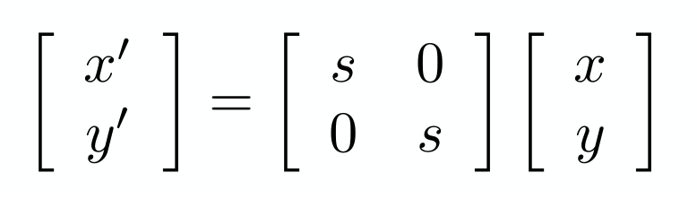

#### 1.1.2 反射变换
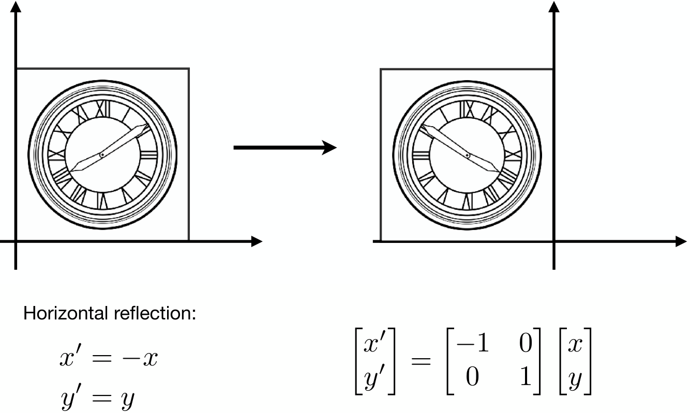

#### 1.1.3  切变变换
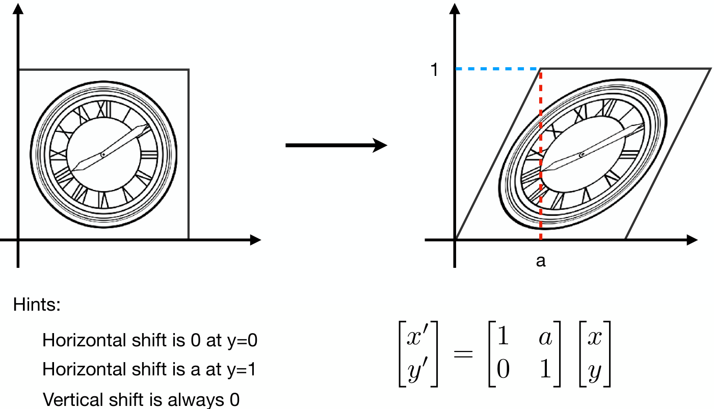

#### 1.1.4  旋转变换
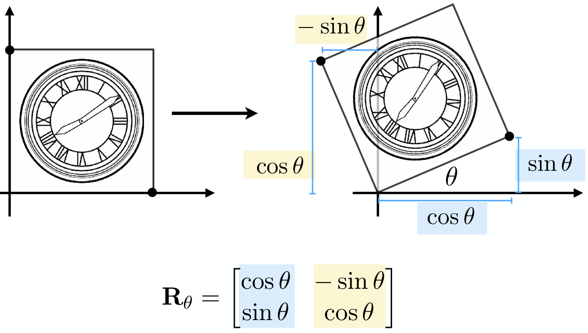

>**推导对应矩阵，就是用特殊点代入去推导**

## 1.2 齐次坐标

#### 1.2.1 平移变换
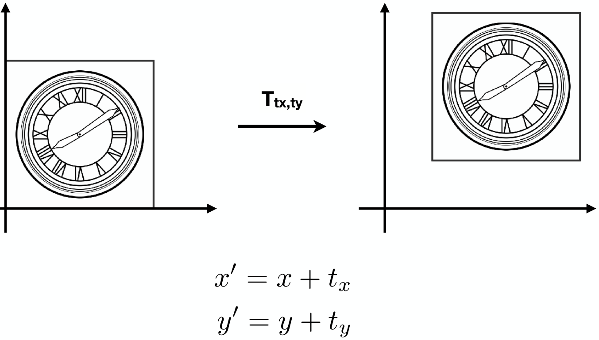

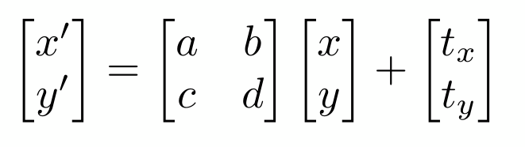
>**平移变换，不是线性变换，我们不想特殊用一种表示去处理平移变换，所以我们引入齐次坐标的概念**

#### 1.2.2 引入齐次坐标

我们通过在n维坐标上，向上引入多一维的坐标，来重新表示点和向量

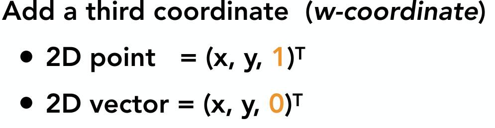

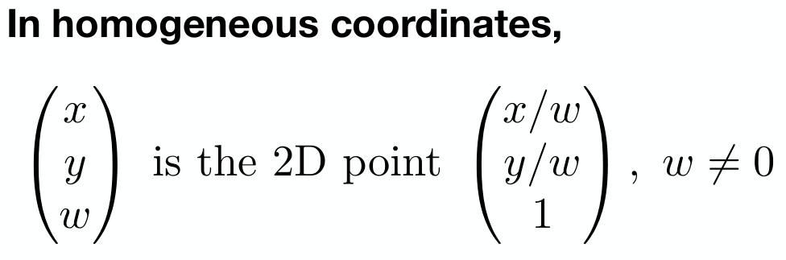

这时候，平移变换就可以这样表示
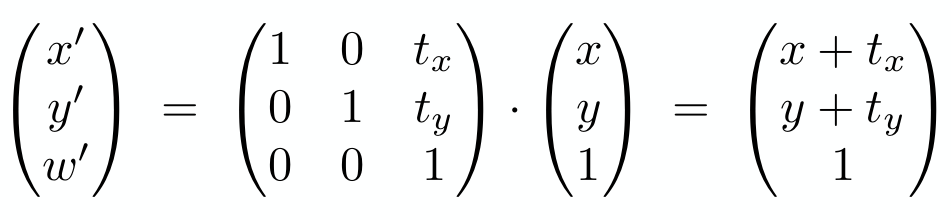

这时候，线性变换+平移变换 ，引入齐次坐标后的表示改变，如下

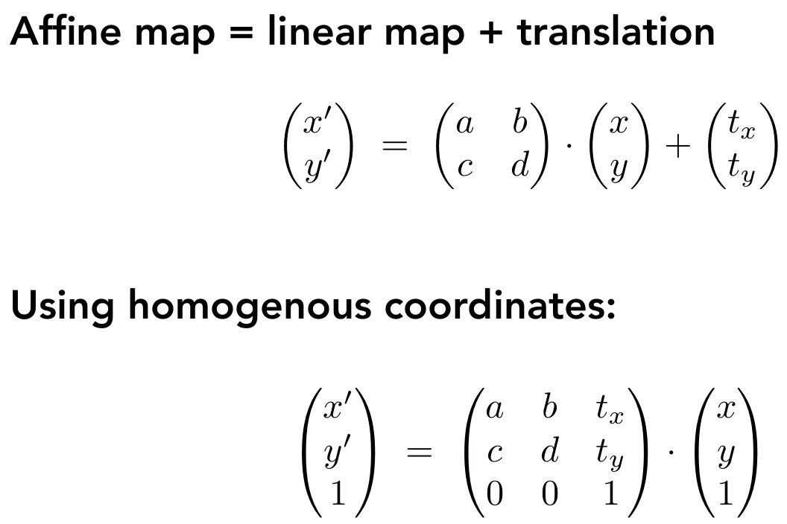

这时候，所有的2D变换，分别可以这样表示，如下

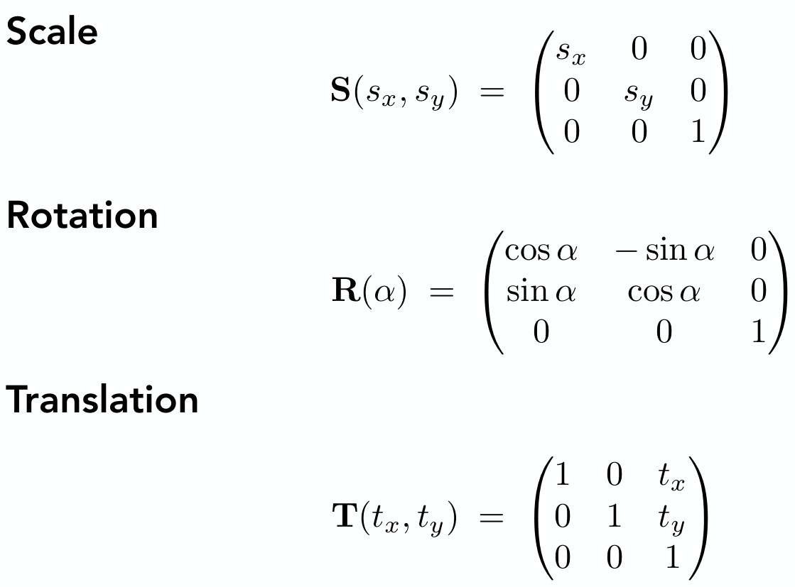

## 1.3 逆变换
在几何上，变换的逆变换，有这样的效果，几何进行了一次变换，再进行一次逆变换，会回到原来的位置

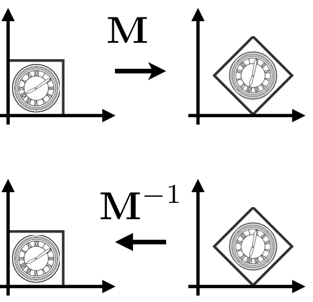

## 1.4 组合变换

#### 1.4.1 组合变换中，变换的顺序很重要
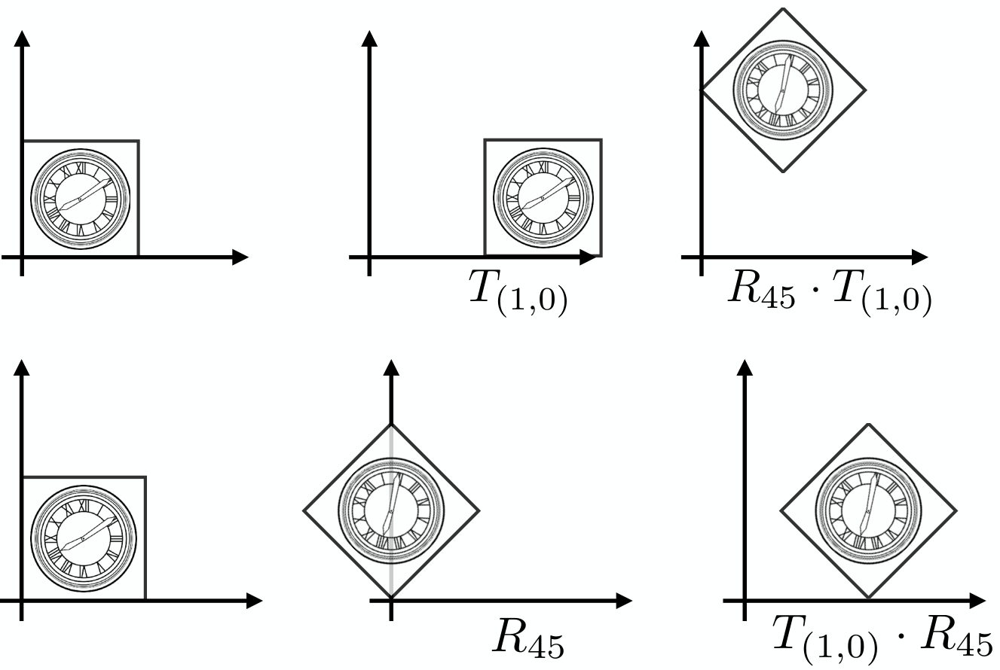
可以用结合律，将很多次的变换，通过结合律，算出最后一个变换
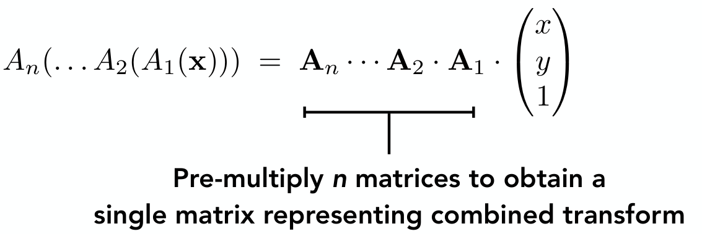

## 1.5分解复杂的变换

#### 1.5.1 思考如果绕着一个点做旋转

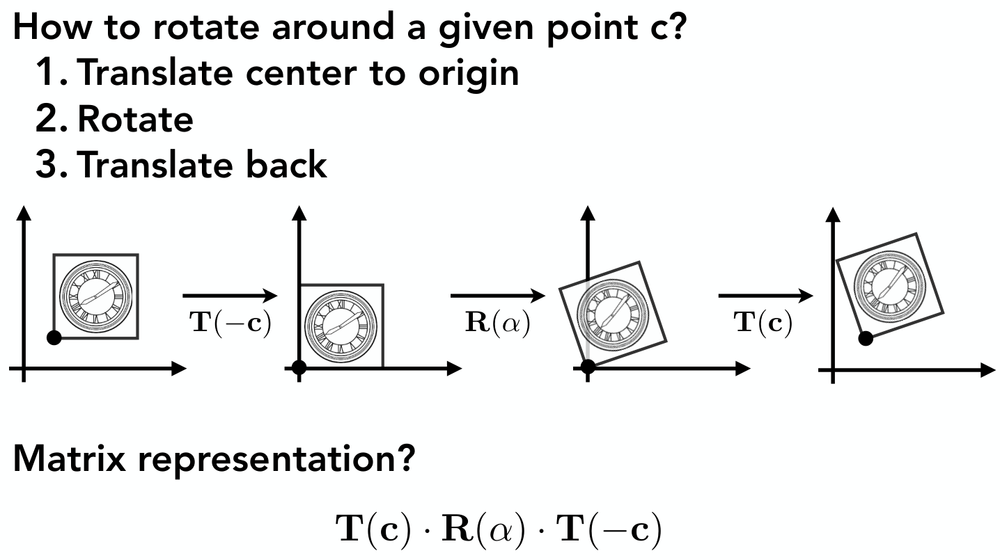

先平移的逆变换到原点，做旋转变换，再通过做平移变换，得出最后想要的结果

## 1.5 3D坐标中的变换

可以类比2D,得出相同的结论

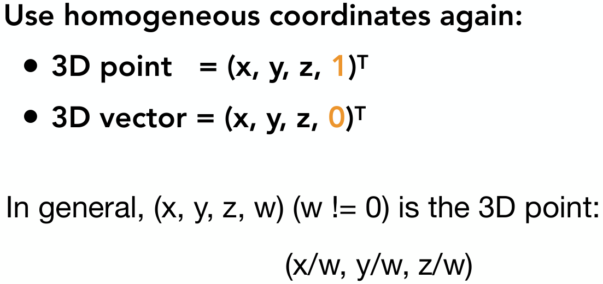

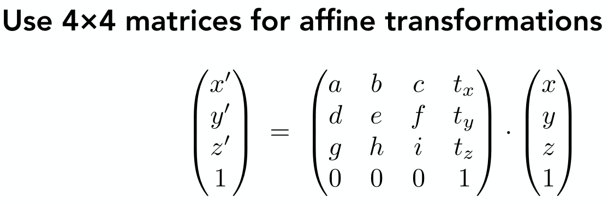

