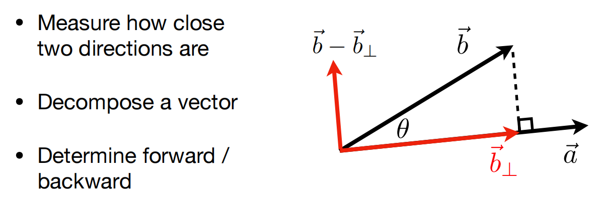
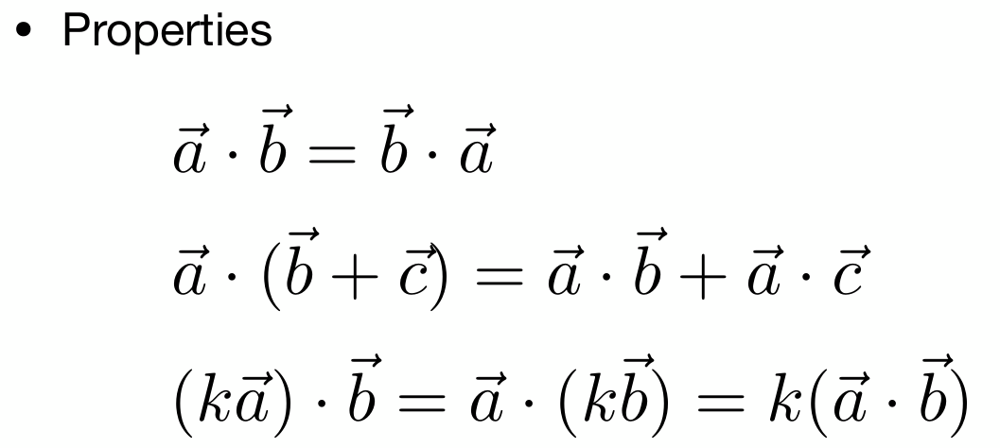
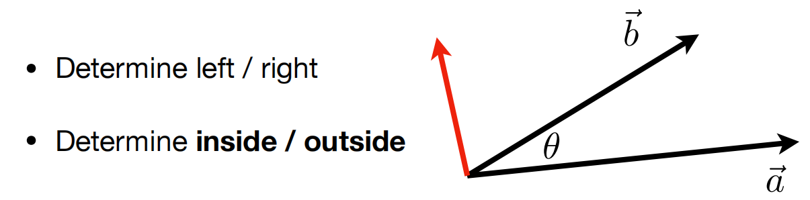
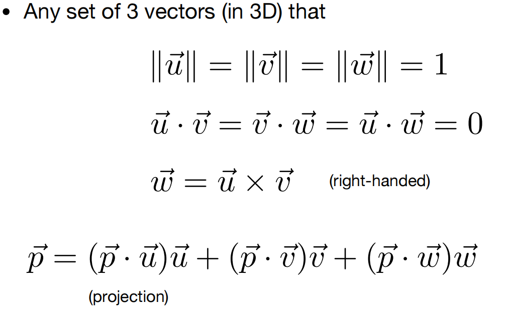
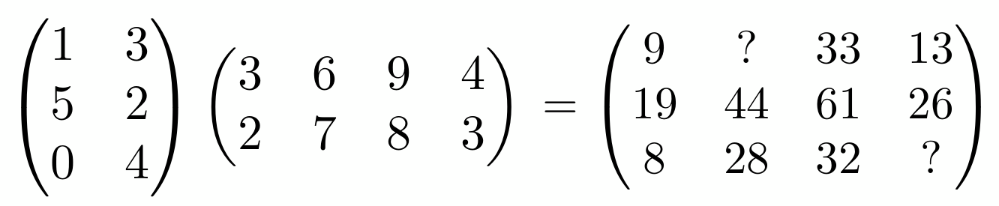
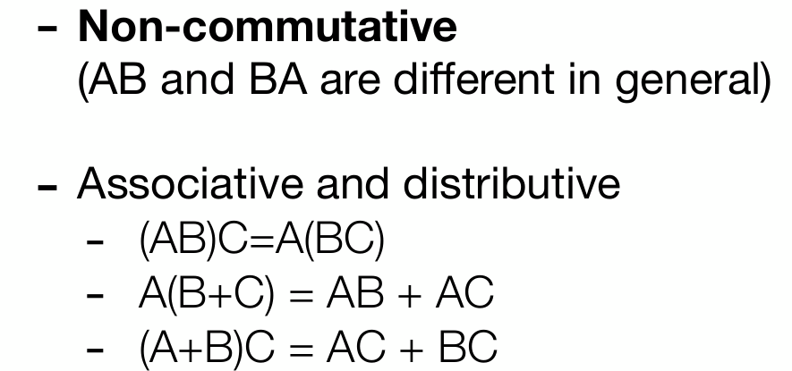
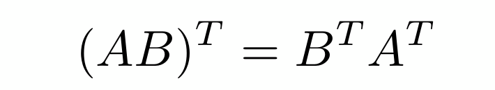
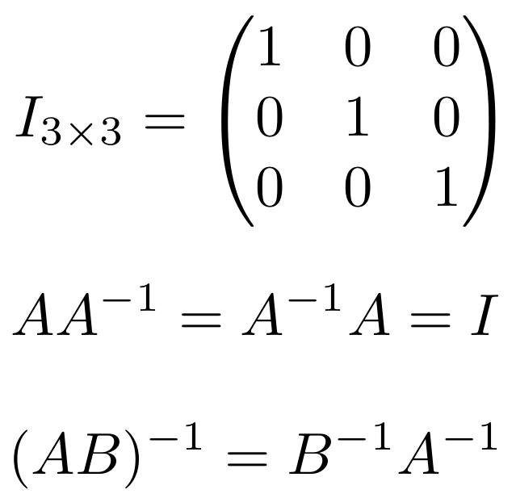

## 1.1 向量的点积

1、分解向量，做投影

2、通过点积的正负值，判断前后关系

3、点积满足 交换律、分配律、结合律

## 1.2 向量的叉积

1、判断左右

2、判断内外

## 1.3 向量的分解

在任何一个标准的坐标系中的一个向量，可以分解成该向量分别向3个轴的投影相加

## 1.4 矩阵相乘怎么算

看下图，等式右边 2行4列的26，取左边第一个矩阵的2行(5,2)，第二个矩阵的(4,3)T, 26= 5x4+2x3

## 1.5 矩阵相乘 

1、矩阵相乘 不满足交换律

2、矩阵的转置 相乘 满足下面的公式

3、矩阵的逆相乘 满足下面的公式

